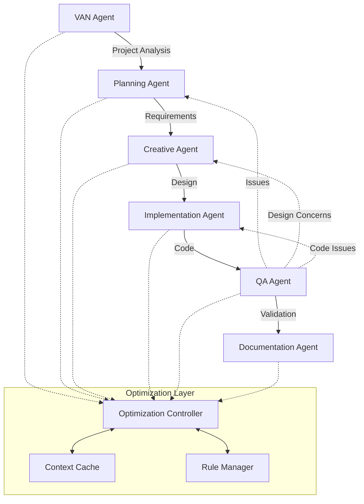
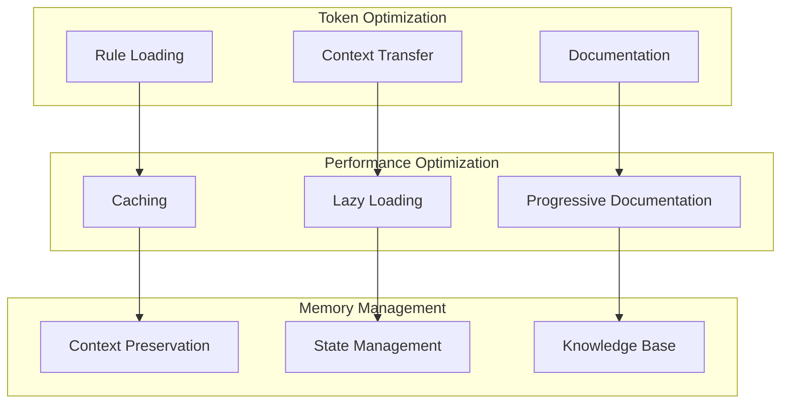

# Cursor Agent System

## Overview

The Cursor Agent System is a sophisticated AI-powered development assistant that operates through specialized agents, each designed to handle specific aspects of the software development lifecycle. This system builds upon and evolves from the Memory Bank architecture, transforming it into a more dynamic and intelligent collective of specialized agents.

## Core Agents

### 1. VAN (Validation and Analysis) Agent
- **Primary Role**: Project initialization and technical validation
- **Responsibilities**:
  - Project structure analysis
  - Complexity assessment
  - Environment validation
  - Technical requirements verification
  - Platform-specific adaptation
- **Optimizations**:
  - Hierarchical rule loading for efficient initialization
  - Adaptive complexity model for accurate assessment
  - Cached validation results for quick reference
  - Platform-aware command adaptation
  - Selective context loading based on project type

### 2. Planning Agent
- **Primary Role**: Task breakdown and strategy development
- **Responsibilities**:
  - Requirement analysis
  - Task decomposition
  - Resource estimation
  - Dependency mapping
  - Risk assessment
- **Optimizations**:
  - Progressive documentation based on complexity
  - Token-efficient planning templates
  - Intelligent task prioritization
  - Context-aware resource allocation
  - Risk-based planning adaptation

### 3. Creative Agent
- **Primary Role**: Design and architecture decisions
- **Responsibilities**:
  - Solution architecture
  - Design pattern selection
  - Technology stack optimization
  - UI/UX considerations
  - Performance strategy
- **Optimizations**:
  - Progressive creative phase documentation
  - Tabular option comparison for efficiency
  - Detail-on-demand approach
  - Complexity-appropriate documentation scaling
  - Token-optimized design templates

### 4. Implementation Agent
- **Primary Role**: Code development and integration
- **Responsibilities**:
  - Code generation
  - Testing implementation
  - Documentation
  - Performance optimization
  - Code review preparation
- **Optimizations**:
  - Level-specific workflow optimization
  - Consolidated memory bank updates
  - Streamlined verification processes
  - Efficient context preservation
  - Intelligent code template selection

### 5. QA Agent
- **Primary Role**: Quality assurance and validation
- **Responsibilities**:
  - Code quality verification
  - Test coverage analysis
  - Performance testing
  - Security assessment
  - Standards compliance
- **Optimizations**:
  - Unified validation protocol
  - Cached validation results
  - Progressive test coverage
  - Efficient error reporting
  - Context-aware quality checks

### 6. Documentation Agent
- **Primary Role**: Documentation and knowledge management
- **Responsibilities**:
  - Technical documentation
  - API documentation
  - Usage guides
  - Architecture documentation
  - Maintenance guides
- **Optimizations**:
  - Progressive documentation approach
  - Token-efficient templates
  - Complexity-based scaling
  - Differential documentation updates
  - Context-preserving documentation structure

## Agent Interaction Patterns

### Core Workflow



### Complexity-Based Workflows

1. **Level 1 (Quick Fix)**
   ```mermaid
   graph LR
       VAN --> IMPL[Implementation]
       IMPL --> QA
   ```

2. **Level 2 (Simple Enhancement)**
   ```mermaid
   graph LR
       VAN --> PLAN --> IMPL[Implementation]
       IMPL --> QA --> DOC
   ```

3. **Level 3 (Feature Development)**
   ```mermaid
   graph LR
       VAN --> PLAN --> CREATE
       CREATE --> IMPL --> QA --> DOC
   ```

4. **Level 4 (Complex System)**
   ```mermaid
   graph TD
       VAN --> PLAN
       PLAN --> CREATE
       CREATE --> IMPL
       IMPL --> QA
       QA --> DOC
       
       QA -.-> PLAN
       QA -.-> CREATE
       IMPL -.-> CREATE
   ```

### Agent Communication Protocol

1. **Context Transfer**
   ```mermaid
   sequenceDiagram
       participant S as Source Agent
       participant C as Context Cache
       participant T as Target Agent
       
       S->>C: Store Context
       C->>C: Optimize & Cache
       T->>C: Request Context
       C->>T: Return Optimized Context
   ```

2. **Rule Loading**
   ```mermaid
   sequenceDiagram
       participant A as Agent
       participant R as Rule Manager
       participant C as Cache
       
       A->>R: Request Rules
       R->>C: Check Cache
       C-->>R: Cache Hit/Miss
       R->>R: Load & Optimize
       R->>A: Return Rules
   ```

### Optimization Integration



## Memory Management

Each agent maintains and updates shared memory structures:

- **Project Context**: Overall project understanding
- **Technical Context**: Technical decisions and constraints
- **Active Context**: Current focus and state
- **Progress Tracking**: Implementation status
- **System Patterns**: Architectural decisions

## Agent Communication Protocol

1. **Context Sharing**
   - Agents share context through structured memory files
   - Each agent updates relevant sections based on their actions
   - Changes are propagated to all agents in real-time

2. **Workflow Transitions**
   - Clear handoff procedures between agents
   - Context preservation during transitions
   - Validation checks at transition points

3. **Error Handling**
   - Structured error reporting
   - Automatic escalation paths
   - Recovery procedures

## Usage Guidelines

### 1. Starting a New Project
```bash
# Initialize with VAN Agent
/van init

# Proceed with Planning Agent
/plan analyze
```

### 2. Feature Development
```bash
# Start with Planning Agent
/plan feature "Feature Name"

# Move to Creative Phase
/creative design "Feature Name"

# Implementation
/implement "Feature Name"
```

### 3. Quality Assurance
```bash
# Run QA checks
/qa verify

# Document changes
/doc update
```

## Best Practices

1. **Always Start with VAN**
   - Let VAN Agent analyze the project first
   - Follow complexity-based workflow recommendations

2. **Maintain Context**
   - Keep memory structures updated
   - Document significant decisions
   - Track progress consistently

3. **Use Appropriate Agents**
   - Match agent capabilities to tasks
   - Allow agents to collaborate when needed
   - Follow recommended workflow patterns

## Version Information

Current Version: 1.0.0
- Evolved from Memory Bank v0.7-beta
- Enhanced agent specialization
- Improved interaction patterns
- Optimized memory management

## Future Directions

1. **Enhanced Specialization**
   - More specialized agents for specific domains
   - Improved inter-agent communication
   - Advanced context sharing mechanisms

2. **Workflow Optimization**
   - Automated agent selection
   - Dynamic workflow adaptation
   - Improved error recovery

3. **Integration Capabilities**
   - Better CI/CD integration
   - Enhanced tool integration
   - Expanded platform support
