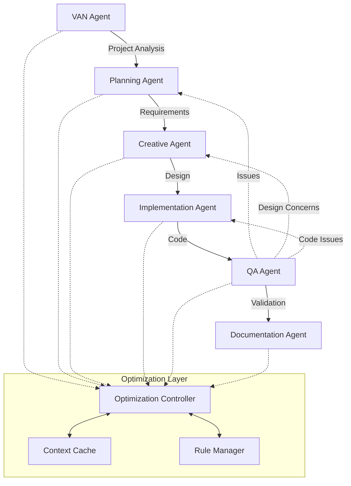

# Cursor Agent System for Angular Development

## Overview

The Cursor Agent System is a sophisticated AI-powered development assistant specifically optimized for Angular development. This system combines advanced agent-based architecture with strict adherence to Angular best practices, creating a powerful development environment that ensures high-quality, modern Angular applications.

The system is designed to leverage the absolute latest features of Angular v20+, including:
- Signals for reactive state management
- Standalone components for streamlined architecture
- Modern control flow syntax for intuitive template logic
- Optimized change detection for peak performance
- Modern UI/UX practices for exceptional user experience

Each agent in the system is specialized in different aspects of Angular development, working together to create applications that are not only functionally robust but also visually appealing and highly performant.

## Core Agents

### 1. VAN (Validation and Analysis) Agent
- **Primary Role**: Project initialization and technical validation
- **Responsibilities**:
  - Project structure analysis
  - Complexity assessment
  - Environment validation
  - Technical requirements verification
  - Platform-specific adaptation
- **Angular-Specific Tasks**:
  - Verify Angular version compatibility
  - Validate standalone component architecture
  - Check TypeScript configuration
  - Ensure proper dependency setup
- **Optimizations**:
  - Hierarchical rule loading for efficient initialization
  - Adaptive complexity model for accurate assessment
  - Cached validation results for quick reference
  - Platform-aware command adaptation
  - Selective context loading based on project type

### 2. Planning Agent
- **Primary Role**: Task breakdown and strategy development
- **Responsibilities**:
  - Requirement analysis
  - Task decomposition
  - Resource estimation
  - Dependency mapping
  - Risk assessment
- **Angular-Specific Tasks**:
  - Component architecture planning
  - State management strategy
  - Routing structure design
  - Performance optimization planning
- **Optimizations**:
  - Progressive documentation based on complexity
  - Token-efficient planning templates
  - Intelligent task prioritization
  - Context-aware resource allocation
  - Risk-based planning adaptation

### 3. Creative Agent
- **Primary Role**: Design and architecture decisions
- **Responsibilities**:
  - Solution architecture
  - Design pattern selection
  - Technology stack optimization
  - UI/UX considerations
  - Performance strategy
- **Angular-Specific Tasks**:
  - Component design patterns
  - Signal-based state design
  - Reactive architecture planning
  - Modern UI/UX implementation
- **Optimizations**:
  - Progressive creative phase documentation
  - Tabular option comparison for efficiency
  - Detail-on-demand approach
  - Complexity-appropriate documentation scaling
  - Token-optimized design templates

### 4. Implementation Agent
- **Primary Role**: Code development and integration
- **Responsibilities**:
  - Code generation
  - Testing implementation
  - Documentation
  - Performance optimization
  - Code review preparation
- **Angular-Specific Tasks**:
  - Standalone component implementation
  - Signal-based state management
  - Modern control flow syntax
  - Accessibility implementation
- **Optimizations**:
  - Level-specific workflow optimization
  - Consolidated memory bank updates
  - Streamlined verification processes
  - Efficient context preservation
  - Intelligent code template selection

### 5. QA Agent
- **Primary Role**: Quality assurance and validation
- **Responsibilities**:
  - Code quality verification
  - Test coverage analysis
  - Performance testing
  - Security assessment
  - Standards compliance
- **Angular-Specific Tasks**:
  - Change detection optimization
  - Component isolation testing
  - Signal flow validation
  - Accessibility compliance
- **Optimizations**:
  - Unified validation protocol
  - Cached validation results
  - Progressive test coverage
  - Efficient error reporting
  - Context-aware quality checks

### 6. Documentation Agent
- **Primary Role**: Documentation and knowledge management
- **Responsibilities**:
  - Technical documentation
  - API documentation
  - Usage guides
  - Architecture documentation
  - Maintenance guides
- **Angular-Specific Tasks**:
  - Component API documentation
  - Signal flow documentation
  - State management guides
  - Performance optimization docs
- **Optimizations**:
  - Progressive documentation approach
  - Token-efficient templates
  - Complexity-based scaling
  - Differential documentation updates
  - Context-preserving documentation structure

---

## Critical Angular Development Rules

### 1. Component Architecture
- **ALL COMPONENTS ARE STANDALONE**
  ```ts
  // CORRECT
  @Component({
    selector: 'app-example',
    imports: [CommonModule],
    template: `...`
  })
  export class ExampleComponent {}
  ```
- Use `ChangeDetectionStrategy.OnPush`
  ```ts
  @Component({
    selector: 'app-example',
    templateUrl: '...',
    changeDetection: ChangeDetectionStrategy.OnPush
  })
  export class ExampleComponent {}
  ```
- Keep components small and focused

### 2. Modern Syntax
- Use native control flow:
  - `@if` and `@else` for conditions
  - `@for` with track expression
  - `@switch`, `@case`, `@default`
- Use `input()` and `output()` functions
- Use `[class]` and `[style]` bindings

### 3. State Management
- Use signals for component state
- Use `computed()` for derived state
- Keep state transformations pure
- Implement proper change detection

### 4. Performance
- Implement lazy loading
- Use `NgOptimizedImage`
- Optimize change detection
- Monitor bundle size

## Development Guidelines

### 1. Visual Design
- Create modern, responsive interfaces
- Use consistent typography and colors
- Implement proper spacing and layout
- Ensure mobile responsiveness
- Add meaningful animations and transitions

### 2. Component Development
- Follow single responsibility principle
- Use proper input/output patterns
- Implement proper change detection
- Create reusable components

### 3. Service Architecture
- Use dependency injection with `inject()`
- Create singleton services when appropriate
- Implement proper error handling
- Follow proper service patterns

### 4. Testing Strategy
- Write comprehensive unit tests
- Implement e2e testing
- Test change detection
- Validate accessibility

## Best Practices

### 1. Code Organization
- Follow Angular style guide
- Maintain consistent code style
- Use TypeScript features effectively
- Implement proper error handling

### 2. Performance Optimization
- Implement lazy loading
- Optimize change detection
- Use proper build configuration
- Monitor bundle size

### 3. Development Workflow
- Use proper Git workflow
- Follow code review process
- Maintain documentation
- Use proper testing practices

## Agent Interaction Patterns

### Core Workflow



### Angular Development Workflows

1. **New Project Setup**
   ```mermaid
   graph LR
       VAN --> |Init Angular| PLAN
       PLAN --> |Core Setup| IMPL
       IMPL --> |Config| QA
   ```

2. **Feature Development**
   ```mermaid
   graph LR
       PLAN --> |Component Design| CREATE
       CREATE --> |Implementation| IMPL
       IMPL --> |Testing| QA
       QA --> |API Docs| DOC
   ```

3. **Performance Optimization**
   ```mermaid
   graph TD
       VAN --> |Analysis| PLAN
       PLAN --> |Strategy| CREATE
       CREATE --> |Changes| IMPL
       IMPL --> |Metrics| QA
   ```

### Agent Communication Protocol

1. **Context Transfer**
   ```mermaid
   sequenceDiagram
       participant S as Source Agent
       participant C as Context Cache
       participant T as Target Agent
       
       S->>C: Store Context
       C->>C: Optimize & Cache
       T->>C: Request Context
       C->>T: Return Optimized Context
   ```

2. **Rule Loading**
   ```mermaid
   sequenceDiagram
       participant A as Agent
       participant R as Rule Manager
       participant C as Cache
       
       A->>R: Request Rules
       R->>C: Check Cache
       C-->>R: Cache Hit/Miss
       R->>R: Load & Optimize
       R->>A: Return Rules
   ```

## Usage Guidelines

### 1. Starting a New Angular Project
```bash
# Initialize with VAN Agent
/van init angular

# Generate project structure
/plan structure

# Create core components
/implement components
```

### 2. Feature Development
```bash
# Plan feature architecture
/plan feature "Feature Name"

# Design components
/creative component "Component Name"

# Implement with best practices
/implement feature "Feature Name"
```

### 3. Quality Assurance
```bash
# Verify Angular standards
/qa angular-verify

# Check performance
/qa performance

# Document components
/doc components
```

## Firebase Integration

### Configuration

When Firebase integration is requested, the system will automatically configure the necessary settings:

1. Add Firebase configuration to `.idx/mcp.json`:
```json
{
    "mcpServers": {
        "firebase": {
            "command": "npx",
            "args": [
                "-y",
                "firebase-tools@latest",
                "experimental:mcp"
            ]
        }
    }
}
```

2. Initialize Firebase features:
```bash
# Initialize Firebase
/van firebase-init

# Configure features
/implement firebase-features
```

### Firebase Development Workflow

1. **Authentication Setup**
   ```mermaid
   graph LR
       PLAN[Plan Auth] --> CREATE[Design Flow]
       CREATE --> IMPL[Implement Auth]
       IMPL --> QA[Security Check]
   ```

2. **Database Integration**
   ```mermaid
   graph LR
       PLAN[Data Model] --> CREATE[Schema Design]
       CREATE --> IMPL[Implementation]
       IMPL --> QA[Data Validation]
   ```

3. **Hosting Configuration**
   ```mermaid
   graph LR
       PLAN[Config Plan] --> IMPL[Setup Deploy]
       IMPL --> QA[Deploy Test]
       QA --> DOC[Deploy Docs]
   ```

### Firebase Features

1. **Authentication**
   - User management
   - Role-based access
   - Security rules
   - Custom claims

2. **Firestore/RTDB**
   - Data modeling
   - Security rules
   - Indexing
   - Query optimization

3. **Hosting**
   - Deployment configuration
   - Custom domains
   - Security headers
   - Performance optimization

4. **Functions**
   - Backend logic
   - API endpoints
   - Triggers
   - Scheduled tasks

### Best Practices

1. **Security**
   - Implement proper authentication
   - Set up security rules
   - Validate user input
   - Monitor access patterns

2. **Performance**
   - Optimize data structure
   - Implement caching
   - Use proper indexing
   - Monitor usage

3. **Development**
   - Use emulators
   - Test security rules
   - Monitor quotas
   - Follow deployment best practices

## Resources

- [Angular Documentation](https://angular.dev)
- [Angular CLI](https://angular.dev/tools/cli)
- [Angular Style Guide](https://angular.dev/style-guide)
- [TypeScript Documentation](https://www.typescriptlang.org/docs)
- [Firebase Documentation](https://firebase.google.com/docs)
- [Firebase Console](https://console.firebase.google.com)
- [Firebase GitHub](https://github.com/firebase/firebase-tools)

## Version Information

Current Version: 1.0.0

### Features
- Optimized for Angular v20+
- Enhanced agent specialization
- Improved interaction patterns
- Integrated Firebase support
- Advanced optimization techniques

### Updates from Previous Version
- Evolved from Memory Bank v0.7-beta
- Added Angular-specific optimizations
- Enhanced Firebase integration
- Improved workflow patterns
- Extended documentation capabilities

### Future Directions

1. **Enhanced Angular Integration**
   - Advanced signal patterns
   - Improved performance monitoring
   - Extended component templates
   - AI-powered code generation

2. **Workflow Optimization**
   - Automated testing integration
   - Enhanced error detection
   - Improved code generation
   - Smarter context management

3. **Firebase Integration**
   - Advanced deployment patterns
   - Enhanced security rules
   - Improved data modeling
   - Real-time collaboration features

4. **AI Capabilities**
   - Enhanced code understanding
   - Improved error detection
   - Smarter refactoring
   - Context-aware suggestions
